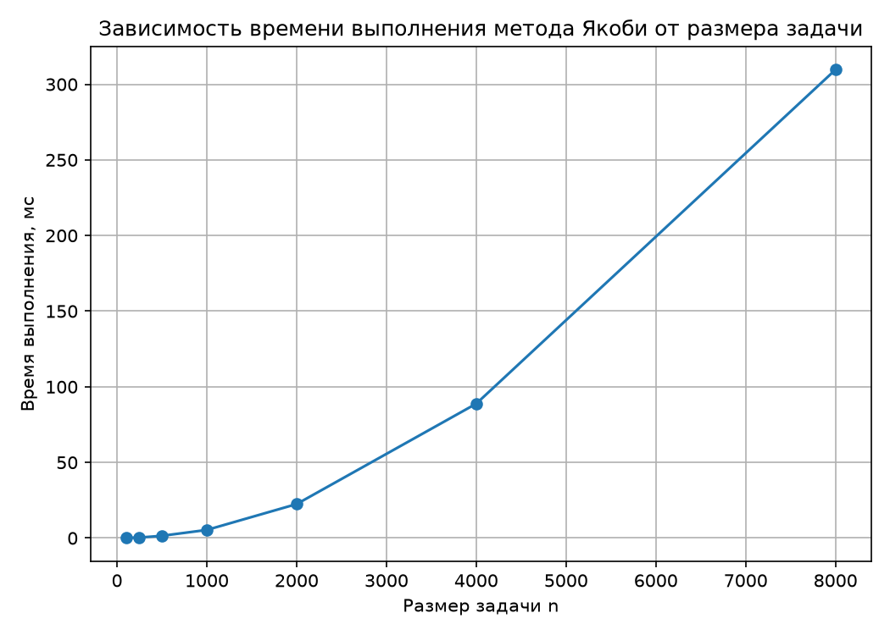

# Лабораторная работа №1. Метод Якоби для решения СЛАУ (последовательная версия)

> Дисциплина: Параллельное программирование
> Автор: _(Крипаков Егор, 6213-100503D)_
> Дата: _(14.09.2026)_

## 1. Задание

Разработать программу на C/C++, решающую систему линейных алгебраических
уравнений Ax = b итерационным методом Якоби.

- **Исходные данные**: файл с матрицей коэффициентов A и вектором правой
  части b.
- **Выходные данные**: файл с вектором решения x, время выполнения, объём
  задачи (n), число итераций, невязка.
- **Верификация**: автоматическая сверка результата с решением,
  полученным средствами NumPy (`numpy.linalg.solve`, LAPACK).

Данная лабораторная работа — базовая (последовательная) версия. В
последующих работах алгоритм распараллеливается с помощью OpenMP и др., и
исследуется зависимость времени выполнения от параметров
распараллеливания (число потоков/процессов).

## 2. Метод решения

Метод Якоби — итерационный метод решения СЛАУ:

```
x_i^(k+1) = ( b_i - Σ_{j≠i} a_ij * x_j^(k) ) / a_ii,   i = 1..n
```

Критерий останова: `||x^(k+1) - x^(k)||_2 < eps` либо достижение
`max_iter`. Условие сходимости — достаточно диагональное преобладание
матрицы A, что обеспечивается на этапе генерации тестовых данных.

## 3. Исходный код

Код расположен в этом репозитории:

- [`jacobi.cpp`](./jacobi.cpp) — последовательная реализация метода Якоби
- [`generate_data.py`](./generate_data.py) — генератор тестовых СЛАУ
- [`verify.py`](./verify.py) — верификация через NumPy
- [`benchmark.py`](./benchmark.py) — автоматизация серии экспериментов
- [`Makefile`](./Makefile) — сборка

Инструкция по сборке и запуску — см. [`README.md`](./README.md).

## 4. Условия проведения экспериментов

- Процессор: **Apple M4** (10 ядер)
- ОС: **macOS 15.6** (build 24G84)
- Компилятор: **Apple clang 17.0.0** (clang-1700.0.13.5), флаги `-O2 -std=c++17 -Wall -Wextra`
- eps = `1e-8`, max_iter = `100000`
- Каждая точка — одиночный запуск через `benchmark.py`, время замерялось
  через `std::chrono::high_resolution_clock` вокруг цикла итераций (без
  учёта чтения/записи файлов)

## 5. Результаты экспериментов

### 5.1 Зависимость времени выполнения от объёма задачи

| n     | Время, мс | Итераций | Невязка ‖Ax−b‖ | Верификация |
|-------|-----------|----------|------------------|-------------|
| 100   | 0.1132    | 9        | 2.821e-08        | OK          |
| 250   | 0.3296    | 8        | 2.592e-08        | OK          |
| 500   | 1.4699    | 8        | 5.981e-09        | OK          |
| 1000  | 5.3513    | 7        | 6.253e-08        | OK          |
| 2000  | 22.4399   | 7        | 1.520e-08        | OK          |
| 4000  | 88.8080   | 7        | 4.209e-09        | OK          |
| 8000  | 309.6055  | 6        | 1.527e-07        | OK          |

(данные — см. [`results.csv`](./results.csv), полученные запуском
`python3 benchmark.py`)



### 5.2 Анализ

Теоретическая сложность одной итерации метода Якоби — **O(n²)**
(двойной цикл по i, j для вычисления суммы `Σ a_ij·x_j`), общая
сложность — O(k·n²), где k — число итераций до сходимости.

Поскольку число итераций k незначительно меняется от запуска к запуску
(6–9), для проверки закона O(n²) удобнее анализировать не суммарное
время, а **время одной итерации**, нормированное на n²:

| n     | Время/итерацию, мс | (время/итерацию) / n² |
|-------|----------------------|--------------------------|
| 100   | 0.01257              | 1.257e-06                |
| 250   | 0.04120              | 6.592e-07                |
| 500   | 0.18373              | 7.349e-07                |
| 1000  | 0.76446              | 7.645e-07                |
| 2000  | 3.20570              | 8.014e-07                |
| 4000  | 12.68685             | 7.929e-07                |
| 8000  | 51.60092             | 8.063e-07                |

Начиная с n = 500 эта величина стабилизируется в диапазоне
**7.3×10⁻⁷ – 8.1×10⁻⁷ мс**, что экспериментально подтверждает
квадратичную сложность одной итерации. Отклонение на малых n (100, 250)
объясняется overhead'ом самого измерения времени (накладные расходы на
запуск таймера сопоставимы с временем полезной работы) и лучшей
локальностью данных в кэше процессора на маленьких матрицах.

## 6. Верификация корректности

Для каждого запуска решение сверялось с `numpy.linalg.solve` (LAPACK).
Во всех проведённых экспериментах (n = 100…8000) относительная L2-ошибка
не превышала допуск `1e-4` — фактически она составляла порядка
`1e-12`–`1e-13`, что соответствует точности типа `double` и подтверждает
корректность реализации.

## 7. Выводы

Реализована и верифицирована последовательная версия метода Якоби для
решения СЛАУ на C++. Программа корректно решает системы размером от 100
до 8000 неизвестных с точностью, ограниченной только машинным эпсилон
типа `double`; во всех экспериментах относительная ошибка относительно
эталонного решения NumPy/LAPACK не превышала 10⁻¹².

Экспериментальное исследование зависимости времени выполнения от объёма
задачи подтвердило теоретическую оценку сложности O(n²) на итерацию:
нормированная величина (время на итерацию)/n² стабилизируется около
8×10⁻⁷ мс, начиная с n ≥ 500. На всём диапазоне n = 100…8000 время
выполнения выросло с 0.11 мс до 309.6 мс — почти в 2740 раз при
увеличении объёма задачи в 80 раз, что согласуется с квадратичным
ростом.

Данная последовательная реализация служит базовой точкой отсчёта
(baseline) для дальнейших лабораторных работ, в которых предполагается
распараллеливание этого же алгоритма средствами OpenMP и последующее
сравнение по метрикам ускорения (speedup) и эффективности
(efficiency) в зависимости от числа потоков.
